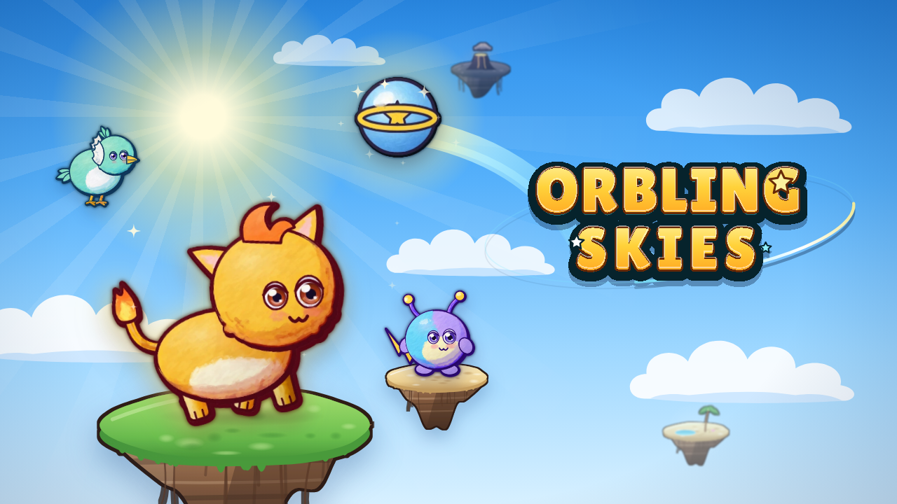
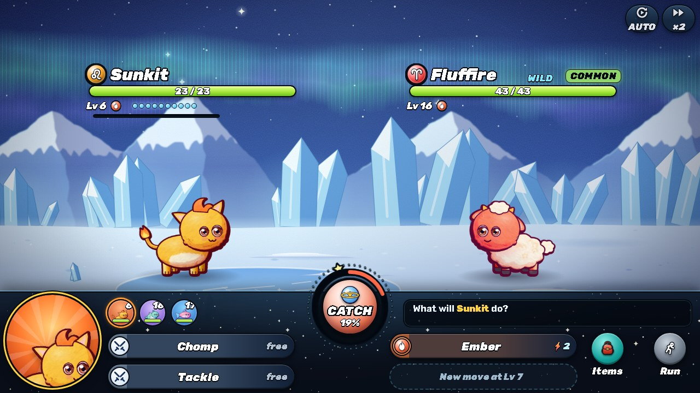
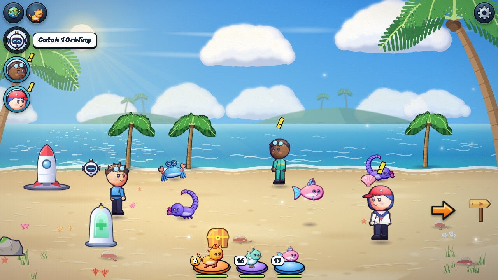
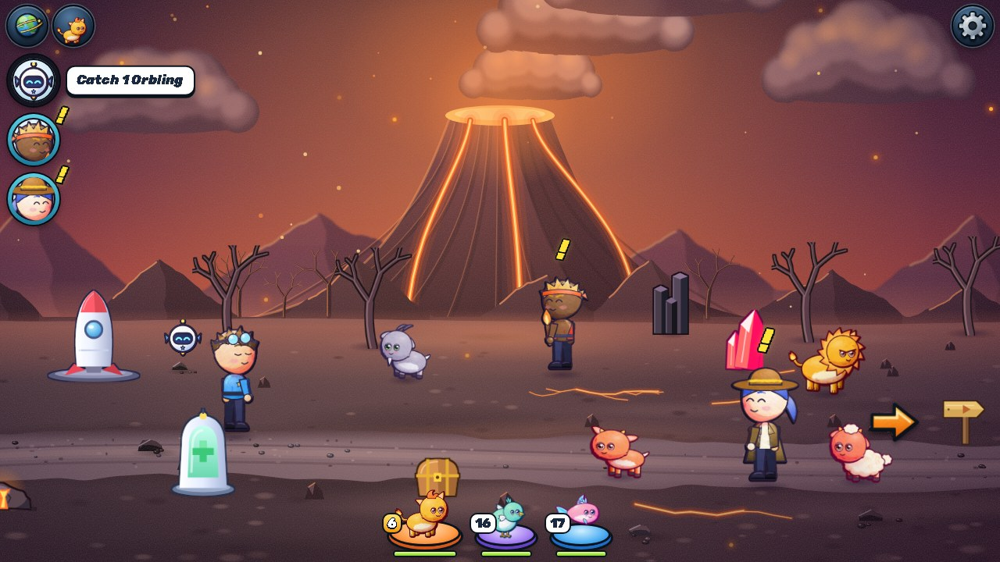

# Orbling Skies



A collectible monster-taming RPG for the browser. Fly between six floating Star Isles, catch Orblings — little
creatures born from falling stars — train them in turn-based battles, evolve them, beat the island Guardians and
collect all 12 legendary Zodiac Orblings.

<p>
  
</p>
<p>
  
  
</p>

## Features

- 48 Orblings: 12 three-stage evolution lines and 12 legends
- 4 elements and 12 star signs with passive traits
- Catching as a short timing mini-game
- 6 isles, trainers, Guardians and a Star Arena with 5 leagues
- A home Base with workshops that keep working while you are away
- 9 languages, mouse, touch and keyboard, phones in portrait and landscape

No dependencies and no image or audio files: all art and sound are generated in code.
The whole game is about 620 KB zipped.

## Run

```bash
python -m http.server 8080
```

Then open `http://localhost:8080/`.

## Build

```bash
node tools/build.js
```

Builds `dist/web`, `dist/poki` and `dist/crazygames`, each with a ready zip.

## Controls

- Click / tap the ground to walk, click an Orbling, trainer or object to interact
- WASD / arrows to move, Space / E to interact
- In battle: 1–4 attacks, C catches

## License

© Marcin Płaza. All rights reserved. Fonts (Rubik, Pangolin, Lilita One) are under the SIL OFL, see `assets/fonts/`.
